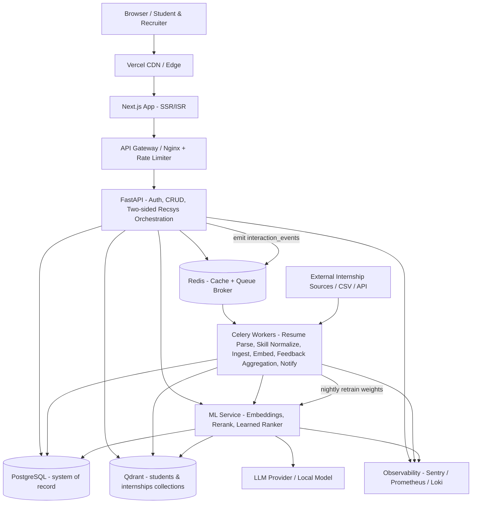
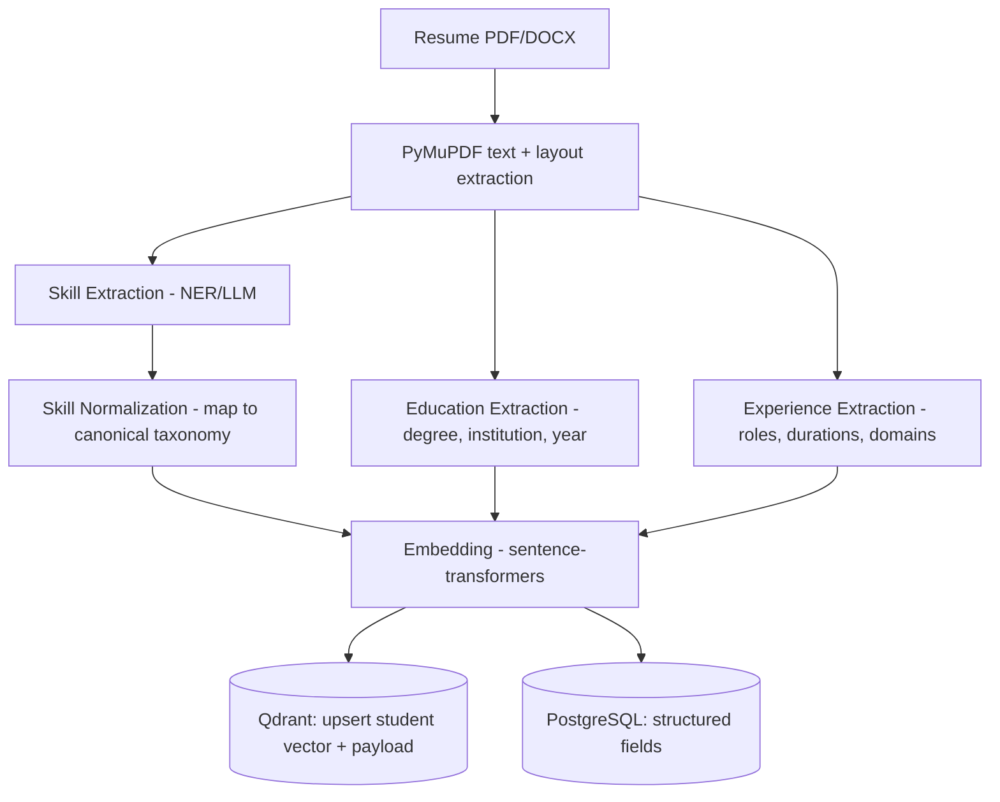
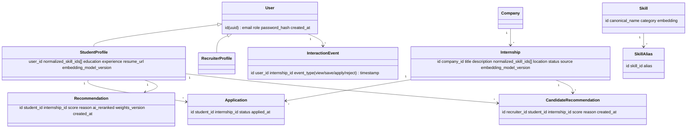
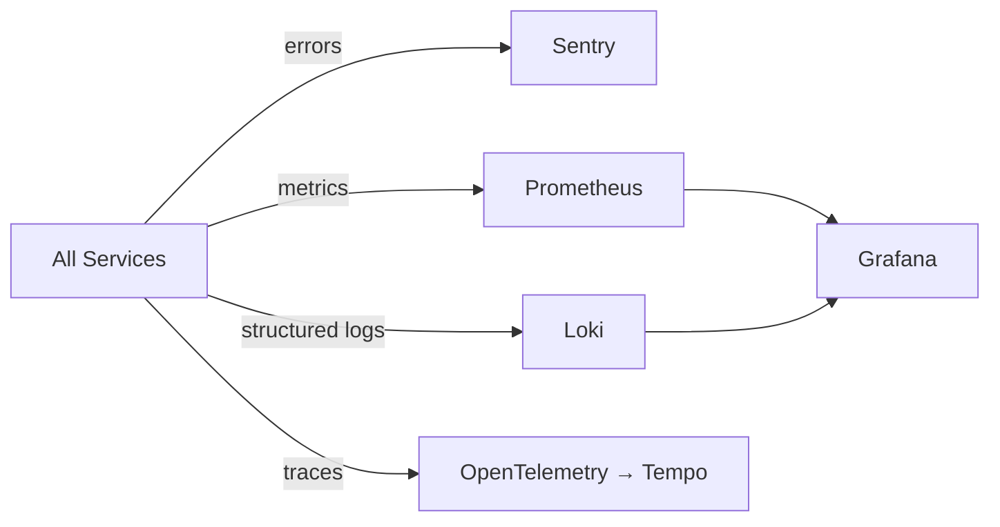
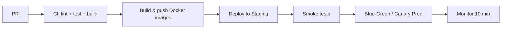
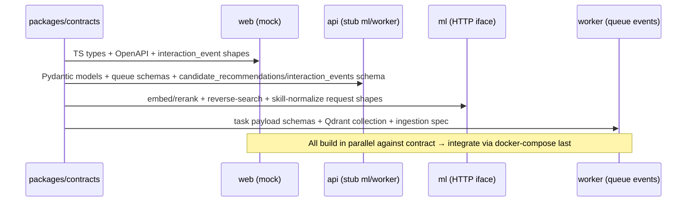

## High-Level System Architecture



---

## 1. Problem Breakdown & Team Distribution

### Core Domains
| Domain | Responsibility | AI Touchpoint |
|---|---|---|
| **Identity & Access** | Auth, roles (student/recruiter/admin), profiles | — |
| **Catalog & Ingestion** | Internship postings, company profiles, external internship ingestion pipeline | Embedding on create/ingest |
| **Skill Taxonomy** | Canonical skill dictionary, normalize/alias free-text skills | Embedding-based fuzzy skill matching |
| **Profile Ingestion** | Resume upload, staged parsing (PyMuPDF), skill/education/experience extraction | PyMuPDF + NER/LLM → normalize → embed |
| **Recommendation Engine** | Two-sided: students↔internships AND recruiters↔candidates (reverse search) | Vector retrieval + learned ranker + LLM rerank |
| **Feedback & Learning** | Capture `interaction_events`, aggregate weighted signals, retrain ranking | Online behavior signals → ranking model |
| **Engagement** | Applications, bookmarks, notifications | Async via workers |
| **Analytics/Admin** | Dashboards, moderation, feedback-loop & career-gap insights | Recsys feedback signals + skill-gap analysis |

### Decoupled Components (Monorepo Layout)
```
/hack
  /apps
    /web        # Next.js (App Router) — Dev A
    /api        # FastAPI — Dev B
  /services
    /worker     # Celery tasks — Dev C
    /ml         # Embedding + recsys microservice — Dev D
  /packages
    /contracts  # OpenAPI spec + shared TS/Pydantic types (SOURCE OF TRUTH)
    /ui         # Shared React components
  /infra        # docker-compose, terraform, CI configs
  docker-compose.yml
```

### Parallelization Strategy
- **Contract-first**: `packages/contracts` holds the OpenAPI schema + DB schema. All four devs agree on it on hour 1, then build independently against mocks.
- **Dev A (Web)** mocks API via MSW; **Dev B (API)** stubs ML/worker calls; **Dev C (Worker)** consumes Redis queue contract; **Dev D (ML)** exposes a thin HTTP `/embed` + `/rerank` interface.
- Integration happens via `docker-compose up` — each service is a separate container.

### Resume Parsing Pipeline (PyMuPDF, staged)
Each stage is an independent, testable Celery sub-step so a failure in one stage degrades gracefully (partial profile) rather than blocking ingest.


- **PyMuPDF (`fitz`)** extracts raw text + layout blocks (handles columns/tables better than naive readers).
- Skill / Education / Experience stages fan out as parallel Celery tasks, then merge.
- **Skill normalization** maps raw strings (e.g., "ReactJS", "react.js") → canonical `react` via the taxonomy layer before embedding.
- **Fallback**: empty/low-confidence extraction → prompt user to confirm skills (cold-start mitigation).

### Skill Taxonomy Normalization Layer
Free-text skills are noisy; normalization is the backbone of accurate matching and gap analysis.
- Canonical `skills` table (id, canonical_name, category, embedding) + `skill_aliases` (alias → skill_id).
- Normalization order: exact alias match → fuzzy/trigram match → embedding nearest-neighbor (cosine) → fallback create pending skill for admin review.
- Both student profiles and internships are normalized to the **same** skill IDs, enabling exact skill-overlap features and **skill-gap analysis**.

### Internship Ingestion Pipeline (Data Acquisition)
Solves the cold-start "no data" problem so recommendations are non-empty on Day 1.
- Sources: recruiter manual posts + bulk CSV import + adapter interface for external job APIs/scrapers (rate-limited, ToS-respecting).
- Celery flow: `fetch → dedupe (hash title+company) → skill-normalize → embed → upsert to Qdrant internships collection + Postgres`.
- Idempotent upserts keyed by source URL/hash; scheduled refresh via Celery Beat.

### Meaningful AI Integration — Two-Sided Retrieve → Rerank → Learn
The **same embedding search runs in reverse**: student-vector → internships collection (student side), internship-vector → students collection (recruiter side).

```mermaid
sequenceDiagram
    participant Actor as Student / Recruiter
    participant API as FastAPI
    participant Q as Qdrant
    participant ML as ML Service
    participant L as LLM
    participant FB as interaction_events
    Actor->>API: GET /recommendations (student) OR /matches (recruiter)
    API->>Q: ANN search top-K=100 (reverse collection for recruiter) + payload filters
    Q-->>API: candidates
    API->>ML: rerank(candidates, query_profile, learned_weights)
    ML->>L: score relevance + generate "why matched"
    L-->>ML: ranked list + explanations
    ML-->>API: top-N (final = α·vector + β·learned + γ·llm)
    API-->>Actor: explainable recommendations (logged as view events)
    Actor->>API: view / save / apply / reject
    API->>FB: record interaction_event
    Note over FB,ML: nightly Celery job aggregates weighted signals → updates ranking weights
```

### AI Limitations & Edge Case Handling (mandatory)
- **Cold start (no resume)**: fall back to rule-based filters (location, declared skills, popularity).
- **LLM downtime/timeout**: serve pure vector-similarity ranking (degraded mode), flag `ai_reranked=false`.
- **Hallucination control**: LLM only *reorders* and *explains* candidates retrieved from real DB rows — never invents internships. Explanations grounded with source field citations.
- **Bias mitigation**: exclude protected attributes (gender, age) from embeddings; log score distributions for audit.
- **Confidence threshold**: suppress matches below a similarity floor; show "broaden your profile" prompt instead of weak results.
- **Embedding drift**: version embeddings (`embedding_model_version` payload in Qdrant); re-embed on model upgrade via batch worker job.
- **Feedback sparsity / cold feedback**: until enough signals exist, fall back to pure semantic ranking; learned weights blend in gradually (confidence-weighted).
- **Feedback gaming / noise**: cap per-user signal weight, debounce rapid clicks, drop events from rate-limited/bot traffic.
- **LLM rerank cost control**: only rerank the top-K (≤50) candidates, cache rerank results in Redis per (profile_version, candidate_set) key, batch LLM calls, and skip LLM entirely in degraded mode (vector + learned only).

### Feedback-Learning Loop (continuous improvement)
Recommendations get smarter from real behavior rather than staying static.
- **Signals (`interaction_events`)**: `view`, `save`, `apply`, `reject` (+ recruiter shortlist/reject), timestamped.
- **Weighting**: `apply = +5`, `save = +3`, `click/view = +1`, `ignored/reject = −1`; aggregated per (user, internship) and per skill/role.
- **Aggregation**: nightly Celery Beat job computes per-skill/role conversion rates and a **learned ranking weight vector** (logistic regression / LightGBM over features: vector_score, skill_overlap, location_match, historical_apply_rate).
- **Serving**: ML rerank blends `final_score = α·vector + β·learned + γ·llm`; weights versioned and hot-loaded with safe rollback.
- **Two-sided learning**: recruiter shortlist/reject signals feed candidate-ranking weights symmetrically.
- **Guardrails**: A/B holdout on pure-semantic ranking to measure lift; auto-revert if precision@10 regresses.

### Cutting-Edge Tech (used appropriately, not gratuitously)
- **Qdrant from Day 1** — purpose-built vector DB (HNSW, payload filtering, named/multi collections) enabling **reverse search** for two-sided matching; runs as a container in `docker-compose`. PostgreSQL stays system-of-record.
- `PyMuPDF (fitz)` for high-fidelity staged resume extraction.
- Streaming LLM explanations via SSE for perceived speed.
- `sentence-transformers` (e.g., `bge`/`e5` family) for embeddings; LLM (OpenAI/local Ollama) for reranking & explanation only.
- **LightGBM/logistic-regression learned ranker** trained on `interaction_events` for the learning loop.

---

## 2. Database & Scalability

### DB Choice & Schema
**PostgreSQL** as system-of-record (ACID, relations, structured data) + **Qdrant** as the dedicated vector store (collections `students` and `internships`, keyed by Postgres UUIDs with filterable payloads). This split powers reverse search for the two-sided marketplace.



> **`candidate_recommendations`** (recruiter side) mirrors `recommendations`: `id, recruiter_id, student_id, internship_id, score, reason` — populated by the reverse embedding search.
> **`interaction_events`**: `user_id, internship_id, event_type, timestamp` — append-only feed for the learning loop.
> **Vector storage**: embeddings live in **Qdrant** (no vector columns in Postgres); points carry payload `{normalized_skill_ids, location, domain, embedding_model_version}`.

### Handling 10,000+ Users
- Stateless API behind load balancer → horizontal scaling.
- Connection pooling via **PgBouncer** (transaction mode) — critical for FastAPI async + many connections.
- Read replicas for recommendation/read-heavy traffic; writes to primary.

### Query Optimization & Indexing
| Need | Index |
|---|---|
| Email login | B-tree unique on `users.email` (Postgres) |
| Vector ANN (both sides) | **HNSW** in Qdrant (cosine) on `students` & `internships` |
| Skill/location filter (ANN) | Qdrant **payload index** on `normalized_skill_ids`, `location`, `domain` |
| Skill filter (SQL) | **GIN** on `normalized_skill_ids[]` (Postgres) |
| Skill alias lookup | B-tree/trigram on `skill_aliases.alias` |
| Listing pagination | Composite B-tree `(status, created_at DESC)` |
| Application lookup | Composite `(student_id, internship_id)` unique |
| Feedback aggregation | Composite `(user_id, internship_id, event_type, timestamp)` on `interaction_events` |
- Keyset (cursor) pagination instead of `OFFSET` for large lists.
- Qdrant **payload pre-filtering** shrinks the candidate set before ANN scoring on both collections.
- `EXPLAIN ANALYZE` on SQL hot paths; partition append-only `interaction_events` by time as volume grows.

### Scaling Hundreds → Millions
1. **Phase 1 (hackathon/hundreds)**: single Postgres + single-node Qdrant (both containers).
2. **Phase 2 (100K+)**: PgBouncer + read replicas; partition `applications`/`recommendations`/`interaction_events` by time/hash; Qdrant HNSW tuning + quantization.
3. **Phase 3 (millions)**: **Qdrant cluster** (sharding/replication); Postgres stays system-of-record; precompute both `recommendations` and `candidate_recommendations` nightly via Celery Beat; feedback aggregation moves to a streaming pipeline.

---

## 3. Security

### Credential Management
- Passwords: **Argon2id** (or bcrypt cost ≥12) via `passlib`. Never store plaintext.
- **JWT**: short-lived access (15 min) + rotating refresh tokens (httpOnly, Secure, SameSite=Strict cookies). Refresh token rotation with reuse detection.
- API keys / secrets: env vars via Doppler/Vault (never committed); separate keys per environment; LLM provider keys server-side only — never exposed to Next.js client.

### Input Validation & Sanitization
- **Pydantic v2** models validate every request body/query at the API boundary (type, length, enum, regex).
- File uploads (resumes): MIME sniffing + extension allowlist (`.pdf/.docx`), size cap, virus scan hook, stored in object storage (S3/R2) not DB.
- Parameterized queries via **SQLAlchemy** (no raw string SQL) → SQLi-proof.
- Output encoding in Next.js (React auto-escapes); strict CSP headers.

### Rate Limiting & Anti-Abuse
- **Redis-backed sliding-window** rate limiter at Nginx/gateway + per-route in FastAPI (`slowapi`).
  - Auth endpoints: 5 req/min/IP.
  - Recommendation (expensive AI): 20 req/min/user.
  - Public listing: 100 req/min/IP.
- CAPTCHA (hCaptcha) on signup/login after N failures.
- Bot/scraping defense: per-account quotas, anomaly detection on burst patterns, WAF (Cloudflare).

---

## 4. Performance

### Caching Strategy
| Layer | What | TTL |
|---|---|---|
| **CDN/Edge** (Vercel) | Static assets, ISR pages | long, revalidate |
| **Redis** | Recommendation results per user | 1h, invalidate on profile change |
| **Redis** | Internship listings, taxonomy | 10 min |
| **HTTP** | `Cache-Control`/`ETag` on public GETs | — |
- Cache stampede protection via locks / `stale-while-revalidate`.

### API Optimization
- Fully **async FastAPI** (async SQLAlchemy + httpx) — non-blocking I/O.
- Offload all heavy work (embedding, parsing, reranking batch) to **Celery**; API stays sub-200ms.
- Response shaping (sparse fieldsets), gzip/brotli, keyset pagination.
- Pre-warm recommendations into cache table via Celery Beat so reads are instant.

### Traffic Spike Survival
- Stateless API → auto-scale (HPA on K8s / multiple containers).
- Queue acts as **shock absorber**: spikes buffer in Redis, workers drain at sustainable rate.
- Circuit breaker on LLM calls → degrade to vector-only mode under load.
- CDN absorbs read traffic; rate limiter sheds abusive load.

---

## 5. Monitoring & Logs

### Observability Stack

- **Errors**: Sentry (frontend + backend + workers) with release tracking.
- **Metrics**: Prometheus scrapes FastAPI (`prometheus-fastapi-instrumentator`), Celery, ML service → Grafana dashboards (latency p50/p95/p99, queue depth, AI rerank success rate).
- **Logs**: structured JSON (`structlog`) → Loki, correlated by request/trace ID.
- **Tracing**: OpenTelemetry across web→api→ml.

### Hypothetical Alerts (Alertmanager → Slack/PagerDuty)
| Alert | Trigger |
|---|---|
| API down | health-check fail > 1 min |
| High error rate | 5xx > 2% over 5 min |
| Queue backlog | Celery pending > 1000 or oldest task > 5 min |
| DB pressure | connections > 80% pool, replication lag > 10s |
| AI degraded | LLM error rate > 20% (auto-switch to fallback) |
| Latency SLO breach | p95 > 800ms |

---

## 6. Reliability & Recovery

### DB Failover
- Managed Postgres (e.g., Neon/RDS/Supabase) with **streaming replication** + automated failover to standby (Patroni for self-hosted).
- App uses health-checked connection string; on primary loss, promote replica; reads continue from replicas during failover.
- **Qdrant**: cluster with replication factor ≥2; on node loss, replicas serve reads. Vectors are reconstructible from Postgres via a re-embed Celery job, so Qdrant is recoverable even on total loss.

### Backups & Recovery
- Automated daily **base backups** + continuous **WAL archiving** → Point-in-Time Recovery (PITR).
- **Qdrant snapshots** scheduled daily (per-collection → object storage), restorable independently.
- Object storage (resumes) versioned with cross-region replication.
- Periodic restore drills to validate backups (recovery is only real if tested).

### Deployment Pipeline & Rollback

- **CI/CD**: GitHub Actions → build per-service images tagged with commit SHA.
- **DB migrations**: Alembic, backward-compatible (expand/contract pattern) so rollback never breaks schema.
- **Rollback steps**: (1) redeploy previous image SHA (blue-green swap, ~seconds), (2) revert feature flag if used, (3) if migration involved, run down-migration only after confirming no data dependency, (4) verify health checks + Sentry clean.

---

## Deliverable Artifacts (to author in repo)

### A. PRD Document — `docs/PRD.md`
Sections to include:
- **Problem & Goal**: Connect students to relevant industry internships via AI matching.
- **Personas**: Student, Recruiter, Admin.
- **User Stories**: profile creation, resume upload (staged parse), get recommendations w/ explanations, view/save/apply/reject (feeds learning loop), recruiter post & **view top candidate matches** (reverse search), recruiter shortlist/reject, view **skill-gap / career analysis**.
- **Success Metrics**: match precision@10 (both sides), **uplift from feedback loop vs. semantic-only baseline**, application conversion, skill-normalization coverage %, time-to-recommendation < 1s (cached).
- **Scope (MVP vs stretch)** and **Out-of-scope**.
- **Non-functional requirements**: 10K users, security, observability (link to this blueprint).

### B. Feature List — `docs/FEATURES.md`
| ID | Feature | Owner | Priority |
|---|---|---|---|
| F1 | Auth (JWT, roles) | Dev B | P0 |
| F2 | Student profile + staged resume parse (PyMuPDF → skills/education/experience) | Dev B/C | P0 |
| F3 | Internship CRUD (recruiter) | Dev B | P0 |
| F4 | Skill taxonomy normalization layer (`skills` + `skill_aliases`) | Dev D/C | P0 |
| F5 | Embedding pipeline + Qdrant upsert (students & internships collections) | Dev D/C | P0 |
| F6 | Student-side recommendation API (retrieve + rerank) | Dev B/D | P0 |
| F7 | **Two-sided recruiter matching** — reverse search → `candidate_recommendations` (id, recruiter_id, student_id, internship_id, score, reason) | Dev B/D/A | P0 |
| F8 | Recommendations/matches UI + explanations + view/save/apply/reject logging | Dev A | P0 |
| F9 | Feedback learning loop — `interaction_events` + weighted scoring (apply+5/save+3/click+1/ignore−1) → retrain weights | Dev D/C | P0 |
| F10 | Internship ingestion pipeline (manual + CSV + external adapter, dedupe→normalize→embed) | Dev C/B | P1 |
| F11 | Applications & bookmarks | Dev B/A | P1 |
| F12 | Notifications (async) | Dev C | P1 |
| F13 | Admin dashboard, moderation & feedback-loop health | Dev A/B | P2 |
| F14 | **Stretch**: Skill-gap analysis & career roadmap generation | Dev D/A | P2 |

### C. Task File — `docs/TASKS.md`
Group by service with `[ ]` checkboxes:
- **Hour 0–1**: finalize `packages/contracts` (OpenAPI + DB schema incl. `candidate_recommendations` & `interaction_events` + queue events + Qdrant collection/payload spec + skill-taxonomy schema).
- **web**: scaffold Next.js App Router, auth pages, profile, student recs page (mock) with view/save/apply/reject logging, **recruiter top-candidate-matches page**, skill-gap/career view (stretch).
- **api**: FastAPI scaffold, SQLAlchemy models + Alembic (incl. `candidate_recommendations`, `interaction_events`, `skills`, `skill_aliases`), auth, CRUD, **student & recruiter (reverse) recsys endpoints**, interaction-event ingestion endpoint, rate limiting, Pydantic validation.
- **worker**: Celery setup, **staged resume-parse tasks** (PyMuPDF → skill/education/experience fan-out → merge), **skill-normalization task**, **internship ingestion task** (fetch→dedupe→normalize→embed), embed + Qdrant upsert, notify task, **nightly feedback-aggregation + weighted retrain job** (Celery Beat), precompute both recommendation sides.
- **ml**: `/embed` + `/rerank` (blends vector + learned + LLM), **two-sided/reverse search** over Qdrant, skill fuzzy/embedding matcher, learned-ranker load/hot-reload with versioning + rollback, LLM rerank w/ top-K cap + Redis cache + fallback, **skill-gap analysis** endpoint (stretch).
- **infra**: docker-compose (web, api, worker, ml, **postgres, qdrant**, redis), GitHub Actions CI, Sentry/Prometheus wiring, seed script with sample internships + canonical skills + synthetic interactions for loop demo.

---

### Integration Contract Flow (the key to zero merge conflicts)

